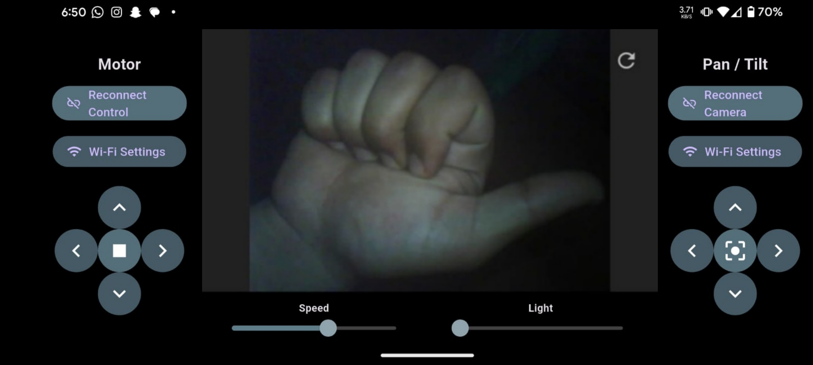
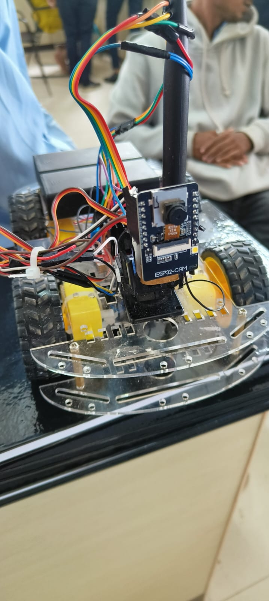
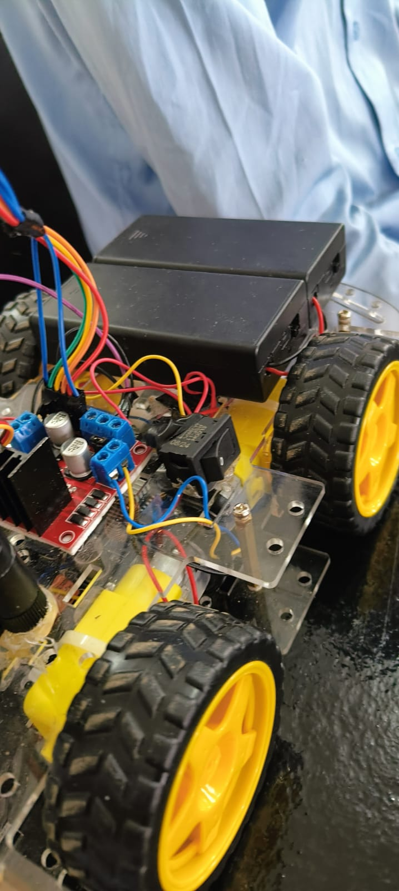
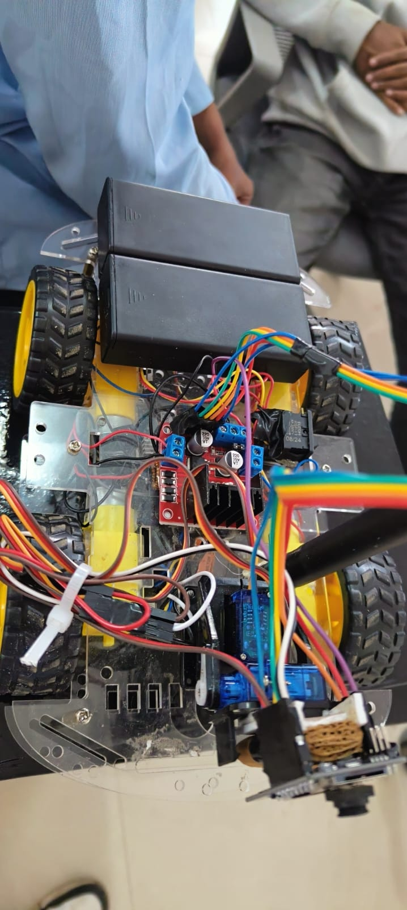

# CameraCarWithPanTiltControl
This repository contains code and diagram for Camera Car with PanTilt Control 
For building hardware use this video - https://www.youtube.com/watch?v=tyY7AN132Xs


## 📌 WiFi Controlled Surveillance Car (ESP32-CAM + Flutter)

A real-time WiFi-controlled surveillance car built using ESP32-CAM, dual DC motors (L298N), and a custom Flutter mobile application for live video streaming and directional control.

This project demonstrates IoT integration, real-time WebSocket communication, embedded systems programming, and mobile app development.

---

## 🛠 Tech Stack

### Hardware

* ESP32-CAM
* L298N Motor Driver
* 2x DC Motors
* 2x Servo Motors (Pan & Tilt)
* 18650 Li-ion Battery Pack

### Software

* Arduino (ESP32 Firmware)
* Flutter (Android Application)
* WebSocket Communication
* AsyncWebServer (ESP32)

---

## ⚙️ Features

* 📡 ESP32 runs in SoftAP mode (creates its own WiFi network)
* 🎥 Live video streaming from ESP32-CAM to Flutter app
* 🎮 Real-time motor control (Forward, Backward, Left, Right, Stop)
* ⚡ Adjustable speed control (PWM)
* 💡 LED brightness control
* 🎯 Servo-based camera pan & tilt control
* 🔄 WebSocket-based low-latency communication
* 📱 Custom mobile UI for intuitive control

---

## 🏗 System Architecture

1. ESP32 creates a WiFi Access Point.
2. Flutter app connects to ESP32 network.
3. Two WebSocket connections are established:

   * `/Camera` → JPEG frame streaming
   * `/CarInput` → Control commands
4. Commands are parsed on ESP32 and executed in real time.

---

## 📷 Application Interface

The mobile app provides:

* Motor directional controls
* Camera pan/tilt controls
* Speed adjustment slider
* Light intensity slider
* Live video preview
* Reconnect functionality

---

## 🧠 Communication Protocol

Control messages are sent via WebSocket in the format:

```
MoveCar,<value>
Speed,<0-255>
Light,<0-255>
Pan,<0-180>
Tilt,<0-180>
```

Camera frames are streamed as binary JPEG data over WebSocket.

---

## 📂 Repository Structure

```
/esp32-firmware    → ESP32-CAM Arduino code
/flutter-app       → Flutter mobile application
```

---

## 🎯 Learning Outcomes

* Embedded system programming with ESP32
* Real-time streaming using WebSockets
* PWM motor speed control
* Servo motor integration
* Mobile-to-hardware communication
* IoT system architecture design
* Debugging hardware-software integration issues

---

## 🚀 How To Run

1. Upload ESP32 firmware via Arduino IDE.
2. Power the ESP32 board.
3. Connect phone to ESP32 WiFi network.
4. Install and open Flutter application.
5. Control the car and view live feed.

---

## 📌 Project Status

✔ Completed as academic IoT project
✔ Fully functional at time of submission

---

### **Working app test image**


### **Model image**





